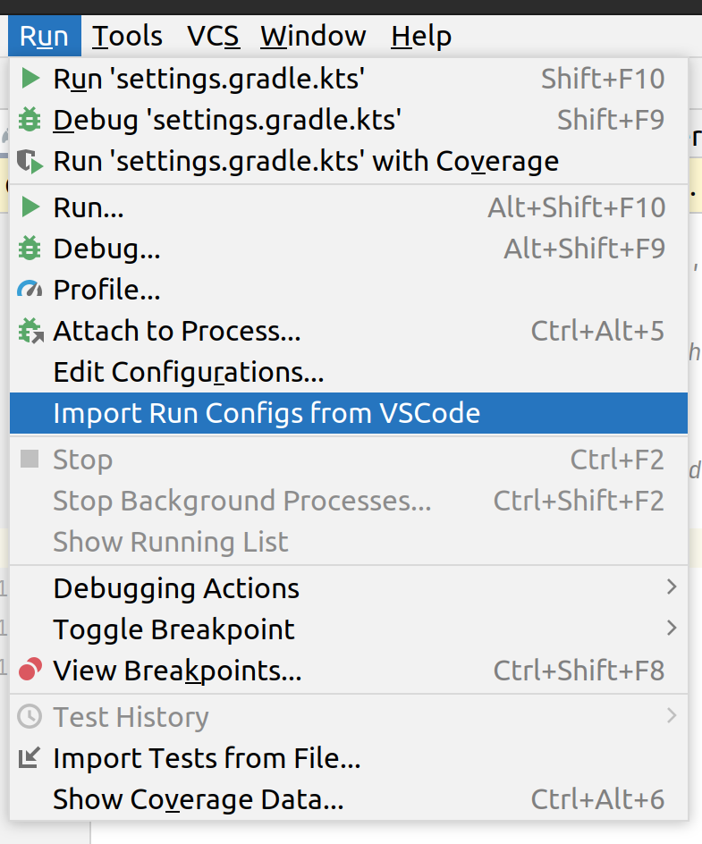

# Import RUN/Debug configurations from VSCode to IJ IDEA

`Version 0.0.1`

## Supported features
* Plain Java **launch** configurations with:
  * Main class - `"mainClass"` in VSCode `launch.json`
  * Program arguments - `"args"`
  * Environment - `"env"` and `"envFile"`
  * Working directory - `"cwd"`
  * Additional class paths - `"classPaths"` without `$Auto`, `$Runtime` and `$Test` argument scopes
  * Additional module paths - `"modulePaths"` without `$Auto`, `$Runtime` and `$Test` argument scopes
  * VM arguments - `"vmArgs"`
  * Shorten Command Line - `"shortenCommandLine"`
  * Basic variable substitutions mapped from VSCode to IJ IDEA

## How to install
1. Download a latest release version for your OS from [here](https://github.com/SuduIDE/ij-vscode-run-config/releases)
2. Open **Settings | Plugins** in IJ IDEA
3. Click on the gear button on the top and select **Install Plugin from Disk...**
4. Choose plugin archive file and apply the changes

## How to use
1. Open your VSCode workspace with java project in IJ IDEA
2. Select **Run | Import Run Configs from VSCode** 

After this, all runnable configurations on the current machine will be imported.

