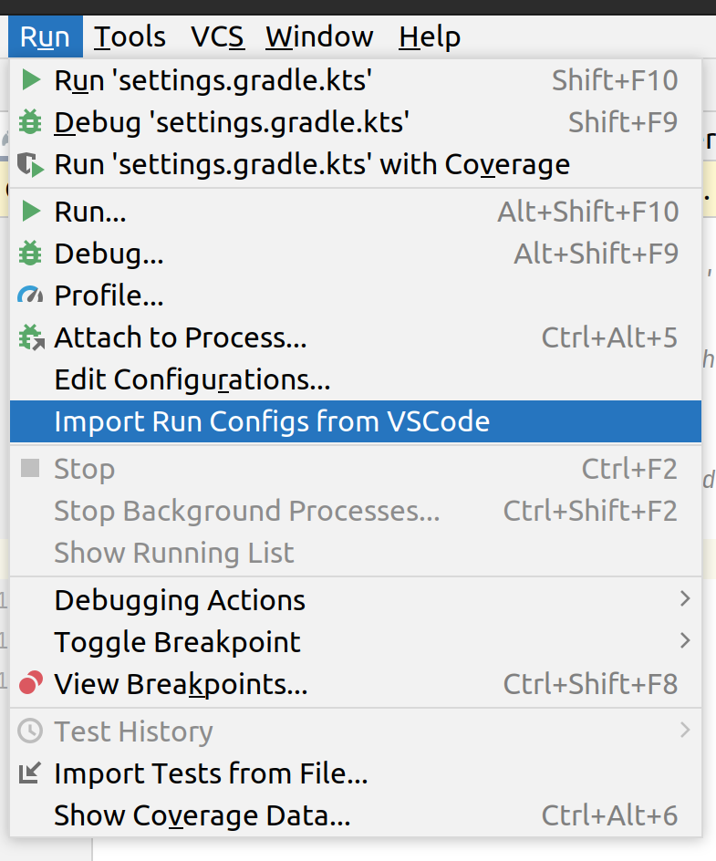

# Plugin for Run/Debug configurations import from VSCode to IJ IDEA

A simple IJ IDEA plugin which imports Run/Debug configurations
from VSCode projects to IJ IDEA projects.

## Requirements
* IJ IDEA CE/UE with version 222.* or higher

## Install
1. Download a latest release version for your OS from [here](https://github.com/SuduIDE/ij-vscode-run-config/releases)
2. Open **Settings | Plugins** in IJ IDEA
3. Click on the gear button on the top and select **Install Plugin from Disk...**
4. Choose plugin archive file and apply the changes

## Use
1. Open your VSCode workspace with java project in IJ IDEA
2. Select **Run | Import Run Configs from VSCode**

After this, all runnable configurations on the current machine will be imported.

## Features

Plugin reads JSON files in `.vscode` folder in the project root.

Note that these JSON files must be correct, without any comments and trailing commas.

### Variables

VSCode supports wide range of different [variables](https://code.visualstudio.com/docs/editor/variables-reference) (e.g. `${userHome}`).

Currently supported kinds of variables:
* [Predefined variables](https://code.visualstudio.com/docs/editor/variables-reference#_predefined-variables)  
Except`${execPath}` and `${defaultBuildTask}` (Unportable)
* [Environment variables](https://code.visualstudio.com/docs/editor/variables-reference#_environment-variables)

Unsupported:
* [VSCode editor configuration variables](https://code.visualstudio.com/docs/editor/variables-reference#_configuration-variables) (Unportable)
* [Command variables](https://code.visualstudio.com/docs/editor/variables-reference#_command-variables) (Unportable)
* [Input variables](https://code.visualstudio.com/docs/editor/variables-reference#_input-variables) (Partially unportable)

During the import process, variables will be either substituted with IJ IDEA analogue variables,
or substituted and immediately expanded, or an error will be generated if the current variable cannot be imported.
In the last case current configuration will be skipped.

### Tasks

Unsupported

### VSCode `launch.json` properties

#### Java

Tested only with ***Maven*** and ***Gradle*** projects. [Platform-specific properties](https://code.visualstudio.com/docs/editor/debugging#_platformspecific-properties) are currently unsupported.

_Since before launch tasks are not supported, IJ IDEA builds Java projects independently._

[VSCode docs](https://code.visualstudio.com/docs/java/java-debugging#_configuration-options)

##### `launch` request type

Supported features:

| Property                         | Description                                                                                                                                                                                                                                                                                                                                                                                                                                                                                                                                                                                                                                                                                                             | Variable substitution                  | Support for Maven |                            Support for  Gradle                            |
|----------------------------------|-------------------------------------------------------------------------------------------------------------------------------------------------------------------------------------------------------------------------------------------------------------------------------------------------------------------------------------------------------------------------------------------------------------------------------------------------------------------------------------------------------------------------------------------------------------------------------------------------------------------------------------------------------------------------------------------------------------------------|----------------------------------------|:-----------------:|:-------------------------------------------------------------------------:|
| `type`   (**required**)      | Configuration type.   **Equals to** `java`                                                                                                                                                                                                                                                                                                                                                                                                                                                                                                                                                                                                                                                                          | **Forbidden**                          |        YES        |                                    YES                                    |
| `request`   (**required**)   | Configuration request type.   **Equals to** `launch`                                                                                                                                                                                                                                                                                                                                                                                                                                                                                                                                                                                                                                                                | **Forbidden**                          |        Yes        |                                    Yes                                    |
| `name`   (**required**)      | Name of the configuration                                                                                                                                                                                                                                                                                                                                                                                                                                                                                                                                                                                                                                                                                               | **Forbidden**                          |        Yes        |                                    Yes                                    |
| `mainClass`   (**required**) | Class containing the main method.   Possible values:   * `com.mypackage.Main` - The fully qualified class name   * `com.java9.mymodule/com.mypackage.Main` - The fully qualified module name and class name   * `/path/to/Main.java` - The file path of the main class                                                                                                                                                                                                                                                                                                                                                                                                                                  | **Forbidden** (skip config if present) |        Yes        |                                    Yes                                    |
| `args`                           | The CLI arguments passed to the program. A string or an array of strings.                                                                                                                                                                                                                                                                                                                                                                                                                                                                                                                                                                                                                                               | Only substitution                      |        Yes        |                                    Yes                                    |
| `classPaths`                     | The classpaths which will be added/excluded to/from project's classpath determined by IJ IDEA.   * `/path/to/append` - append the specified path to the classpath   * `!/path/to/exclude` - exclude the specified path from classpath   * `$Auto`, `$Runtime`, `$Test` scopes - unsupported, because IJ IDEA manages scopes by itself                                                                                                                                                                                                                                                                                                                                                                       | Both substitution and expansion        |        Yes        | ***NO***   IJ IDEA uses classpath defined in gradle project settings  |
| `modulePaths`                    | The module paths which will be excluded from project's modulepaths determined by IJ IDEA   * `!/path/to/exclude` - exclude the specified path from modulepaths   * `/path/to/append` - has no effect * `$Auto`, `$Runtime`, `$Test` scopes - unsupported, because IJ IDEA manages scopes by itself                                                                                                                                                                                                                                                                                                                                                                                                              | Both substitution and expansion        |        YES        | ***NO***   IJ IDEA uses modulepath defined in gradle project settings |                                       
| `vmArgs`                         | The extra options and system properties for the JVM. A string or an array of strings.   If `--class-path <path>` argument is specified here, then it will override default classpath determined by IJ IDEA.   `--module-path <path>` argument will be added to default `--module-path` provided by IJ IDEA (***Warning***: `--module-path` in this case will be passed in several arguments!)                                                                                                                                                                                                                                                                                                                   | Only substitution                      |        YES        |                                    YES                                    |                                                                                                                                                                                                                                                                                      
| `encoding`                       | The `file.encoding` setting for the JVM. Appends to the `vmArgs`.                                                                                                                                                                                                                                                                                                                                                                                                                                                                                                                                                                                                                                                       | None                                   |        YES        |                                    YES                                    |
| `cwd`                            | The working directory of the program. Defaults to project root                                                                                                                                                                                                                                                                                                                                                                                                                                                                                                                                                                                                                                                          | Only substitution                      |        YES        |                                    YES                                    |                                                                                                                                                                                                                                                                                                                                                                
| `env`                            | The extra environment variables for the program. A map-like json object with one or many entries.                                                                                                                                                                                                                                                                                                                                                                                                                                                                                                                                                                                                                       | Only substitution                      |        YES        |                                    YES                                    |
| `envFile`                        | Absolute path to a file containing environment variable definitions. Content is appended to the `"env"` argument.                                                                                                                                                                                                                                                                                                                                                                                                                                                                                                                                                                                                       | Only substitution                      |        YES        |                                    YES                                    |
| `shortenCommandLine`             | hen the project has long classpath or big VM arguments, the command line to launch the program may exceed the maximum command-line string limitation allowed by the OS. By default IJ IDEA automatically detects the command-line length and determines whether to shorten the command line via an appropriate approach.   * `none` - launch the program with `java [options] className [args]`   * `jarmanifest` - generate the classpath parameters to a temporary classpath.jar file, and launch the program with `java -cp classpath.jar className [args]`   * `argFile` - generate the classpath parameters to a temporary argument file, and launch the program with `java @argfile className [args]` | None                                   |        YES        |                                    YES                                    |
| `javaExec`                       | Absolute path to an alternative JRE for running the program. Auto-detected JRE is used if unset.                                                                                                                                                                                                                                                                                                                                                                                                                                                                                                                                                                                                                        | Both substitution and expansion        |        YES        |                                    YES                                    |

Unsupported:
* `sourcePaths` (unportable)
* `projectName` (unportable)
* `stopOnEntry`
* `console` (unportable)
* `stepFilters` (unportable on run configurations IJ IDEA level)
* `suppressMultipleSessionWarning`

#### `attach` request type

| Property                        | Description                                          | Variable substitution | Support for Maven | Support for  Gradle |
|---------------------------------|------------------------------------------------------|-----------------------|:-----------------:|:-------------------:|
| `type`   (**required**)     | Configuration type.   **Equals to** `java`       | **Forbidden**         |        YES        |         YES         |
| `request`   (**required**)  | Configuration request type.   Equals to `attach` | **Forbidden**         |        YES        |         YES         |
| `name`   (**required**)     | Name of the configuration                            | **Forbidden**         |        YES        |         YES         |
| `hostName`   (**required**) | The host name or IP address of remote debuggee       | None                  |        YES        |         YES         |
| `port`   (**required**)     | The debug port of remote debuggee                    | None                  |        YES        |         YES         |

Unsupported:
* `processId` (unportable on run configurations IJ IDEA level)
* `timeout` (unportable on run configurations IJ IDEA level)
* `sourcePaths` (unportable)
* `projectName` (unportable)
* `stepFilters` (unportable on run configurations IJ IDEA level)
* `suppressMultipleSessionWarning`

